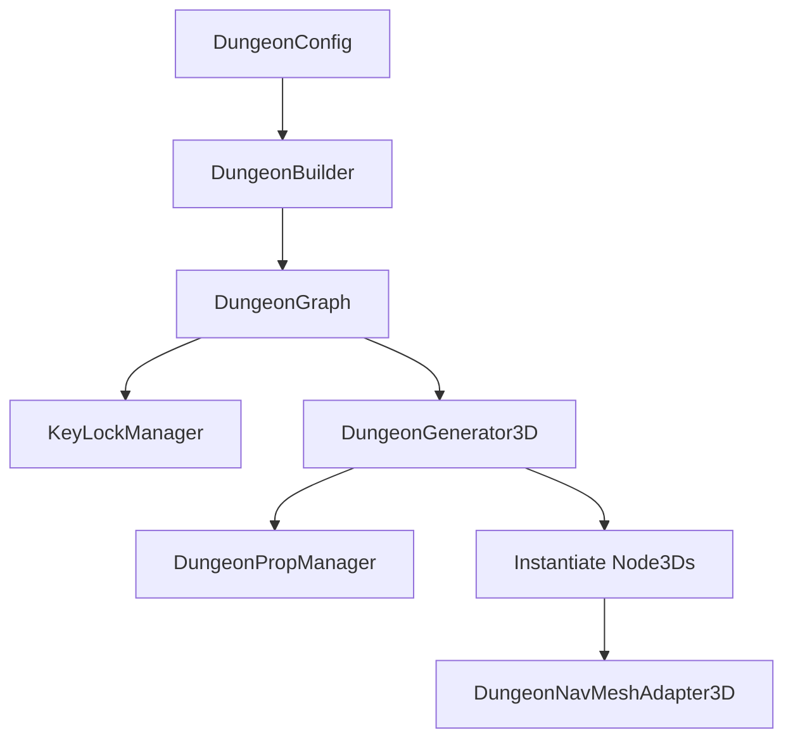

# Godot Plugin Specification: Dungeon Crawler 3D

## 1. Project Overview

**Dungeon Crawler 3D** is a Godot Engine plugin focused on procedural 3D dungeon generation. Inspired by tools like "DunGen" (Unity), the system dynamically assembles complex levels from predefined rooms (modules saved as `PackedScene`), joining them through compatible "connectors" or "doors".

The goal is to provide a robust, high-performance tool natively integrated into the Godot editor, automating level design while maintaining strict control over path flow and validity.

---

## 2. System Architecture

The plugin enforces a clear separation of responsibilities between data computation (pure memory data models) and engine instantiation (SceneTree spawning).



### 2.1. Core Logic (The Generation Engine)

All placement logic operates in memory before interacting with the `SceneTree`.

- **Graph/Grid Management (`DungeonGraph` & `DungeonBuilder`):** The algorithm evaluates the floor plan as a mathematical graph (`DungeonGraph`) representing rooms as nodes and connections as edges.
- **Logical Collision Detection (`AABBManager`):** Performs logical axis-aligned bounding box (AABB) overlap tests in memory to prevent room interpenetration *before* node instantiation.
- **Path Validation (`PathValidator`):** Verifies that a valid, traversable path exists from the Start node to the Boss/Exit node, discarding invalid topologies.
- **Lock & Key Assignment (`KeyLockManager`):** Analyzes the layout graph, identifies locked doors, traces predecessor rooms back to the entrance using BFS/DFS, and allocates keys to valid container rooms dynamically to avoid soft-locks.
- **Prop Randomizer (`DungeonPropManager`):** Evaluates weights and select categories of props dynamically using seed-based RNG, normalizing weights under uniform fallbacks, and clamping totals against global configuration limits.
- **Tile Injection System:** Prioritizes placing unique rooms (such as quest pedestals, merchant shops, or boss rooms) at designated depth percentages along the main path or branch paths, ensuring required injected tiles are successfully placed via seed retries.

### 2.2. Godot Representation and Integration


- **DungeonGenerator3D:** A custom `Node3D` exposed in the Godot editor (`@tool` enabled) that serves as the generation pipeline coordinator, providing action buttons to build and clear layout previews.
- **RoomConnector3D:** A custom `Node3D` placed inside room scenes to define entry/exit ports. It manages:
  - Connection type matching (e.g. "standard_door").
  - Lock states (`is_locked`, `key_id`).
  - Doorway active template scene instantiation (lower graph index rule avoids duplication).
  - Blocker inactive wall scene instantiation (for unused connectors).
  - Magenta/red editor viewport line drawing for locked states.
- **KeySpawnPoint3D:** A custom `Node3D` placed inside rooms marking potential item spawn targets linked to a specific `key_id`.
- **PropGroup3D:** A custom `Node3D` acting as a localized placeholder to trigger prop selection and spawning from configured scene pools.
- **DungeonNavMeshAdapter3D:** A custom `Node` that monitors the completion signal (`generation_completed`) from the generator. It:
  - Dynamically links the generated dungeon root as the geometry parse source.
  - Updates and triggers a NavigationMesh bake on the target `NavigationRegion3D`.
  - Supports thread-based asynchronous baking during gameplay, and synchronous bakes inside the editor viewport under `@tool`.
  - Dynamically spawns a fallback navigation region if missing.

---

## 3. File System Structure

The plugin resides entirely within `plugins/dungeon_crawler_3d/`.

```
dungeon-crawler-3d/
├── plugins/
│   └── dungeon_crawler_3d/
│       ├── core/                           # Decoupled core logic (algorithms, graphs, validation)
│       │   ├── aabb_collision.gd           # Logical collision box calculations (AABBManager)
│       │   ├── connector_matcher.gd        # Connector port transformations and matches
│       │   ├── dungeon_builder.gd          # Procedural layout compilation and backtracking
│       │   ├── dungeon_graph.gd            # Dungeon layout graph nodes and edges
│       │   ├── dungeon_prop_manager.gd     # Seed-based prop evaluation and limit clamping
│       │   ├── key_lock_assignment.gd      # Mappings of key IDs to target spawn points
│       │   ├── key_lock_manager.gd         # Topological puzzle solvability analysis
│       │   ├── path_validator.gd           # Pre-instantiation path checks
│       │   └── room_selector.gd            # Seed-driven room selection helpers
│       ├── nodes/                          # Custom nodes exported in the editor
│       │   ├── dungeon_generator_3d.gd     # Coordinator node for generation workflow
│       │   ├── room_connector_3d.gd        # Connection ports, door, and blocker instantiations
│       │   ├── key_spawn_point_3d.gd       # Key item spawn targets
│       │   ├── prop_group_3d.gd            # Prop placeholders
│       │   └── dungeon_navmesh_adapter_3d.gd # Automatic NavMesh bakes post-generation
│       ├── resources/                      # Custom Resources
│       │   ├── room_data.gd                # Individual room scenes and weights
│       │   ├── tile_injection_rule.gd      # Rules defining topological unique room placement constraints
│       │   └── dungeon_config.gd           # Global parameters (rooms count, seed, pools, limits, injected tiles)
│       ├── plugin.cfg                      # Godot plugin metadata
│       └── dungeon_crawler_3d.gd           # EditorPlugin script (setup and teardown)
├── demo/                                   # Test scenes, assets, and integration test scripts
│   ├── rooms/                              # Pre-defined room scenes (entrance, corridor, junction, boss)
│   ├── test_doorway_blockers.gd            # Doorway blockers test suite
│   ├── test_navmesh_baking.gd              # NavMesh baking test suite
│   ├── test_prop_randomizer.gd            # Prop randomizer test suite
│   ├── test_lock_key.gd                   # Lock & key puzzle validation test suite
│   ├── test_tile_injection.gd             # Tile injection validation test suite
│   └── demo_config.tres                    # Default designer config
└── project.godot
```

---

## 4. Strict Technical Requirements

- **Language:** GDScript exclusively.
- **Static Typing:** All code files MUST use strict static typing (e.g. `var node: Node3D = null`, `func generate() -> void:`).
- **Editor Previews:** Node classes utilize `@tool` tags to support building, rendering, clearing, and debugging directly in the Godot viewport.
- **Loose Coupling:** Communication relies on event-driven Godot `Signal`s (`generation_completed`, `generation_failed`) to decouple downstream tasks like navigation mesh baking or AI path initialization.
- **Resource Configuration:** Design values (spawn weights, room pools, limits) are configured in serializable `Resource` subclasses (`DungeonConfig`, `RoomData`) allowing designers to tweak variables without code changes.
