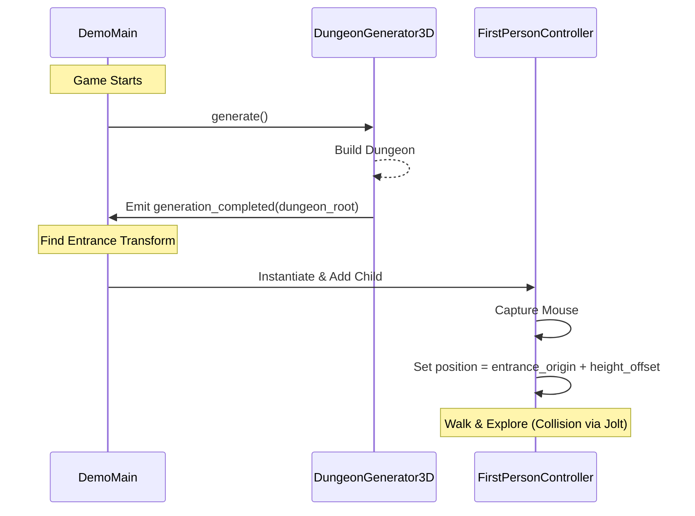

# Data Model & Scene Design: First-Person Controller

This document describes the design of the nodes, resources, and configurations for the First-Person Controller feature.

## Scenes & Nodes

### 1. `FirstPersonController` (Scene: `demo/player/player.tscn`)
An scene representing the player character in first person.

**Structure**:
```text
CharacterBody3D (player.gd)
├── CollisionShape3D (CapsuleShape3D)
└── Head (Node3D)
    └── Camera3D (Camera3D)
```

**Fields/Properties (in `player.gd`)**:
- `@export var speed: float = 5.0` - Walking speed.
- `@export var mouse_sensitivity: float = 0.002` - Mouse look speed.
- `@export var gravity: float = 9.8` - Gravity strength.
- `var _rotation_x: float = 0.0` - Track current camera vertical rotation.
- `var _velocity: Vector3 = Vector3.ZERO` - Velocity vector.

### 2. `DemoMain` (Scene: `demo/demo_main.tscn`)
The main orchestrator scene for playing and testing the dungeon.

**Structure**:
```text
Node3D (demo_main.gd)
├── DungeonGenerator3D (existing node)
├── DirectionalLight3D (basic lighting)
├── WorldEnvironment (environment settings)
└── CanvasLayer (basic UI/instructions overlay)
```

**Properties (in `demo_main.gd`)**:
- `@export var player_scene: PackedScene` - Reference to `player.tscn`.
- `@export var auto_spawn_player: bool = true` - Toggle to spawn on startup after generation.

## State Transitions & Event Flow


